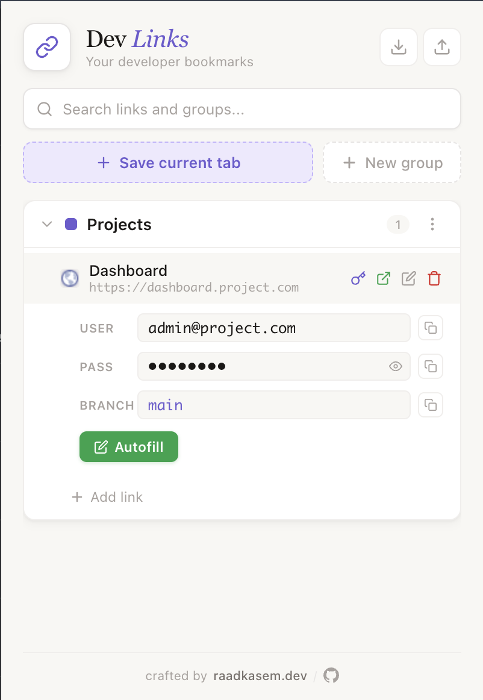
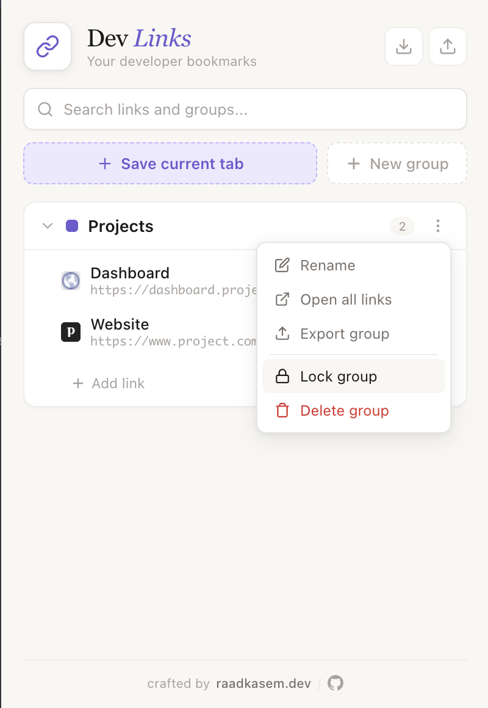
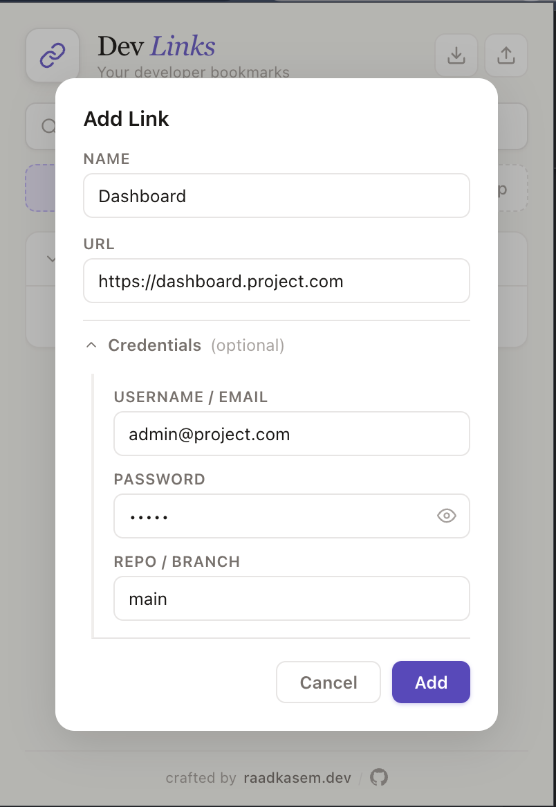
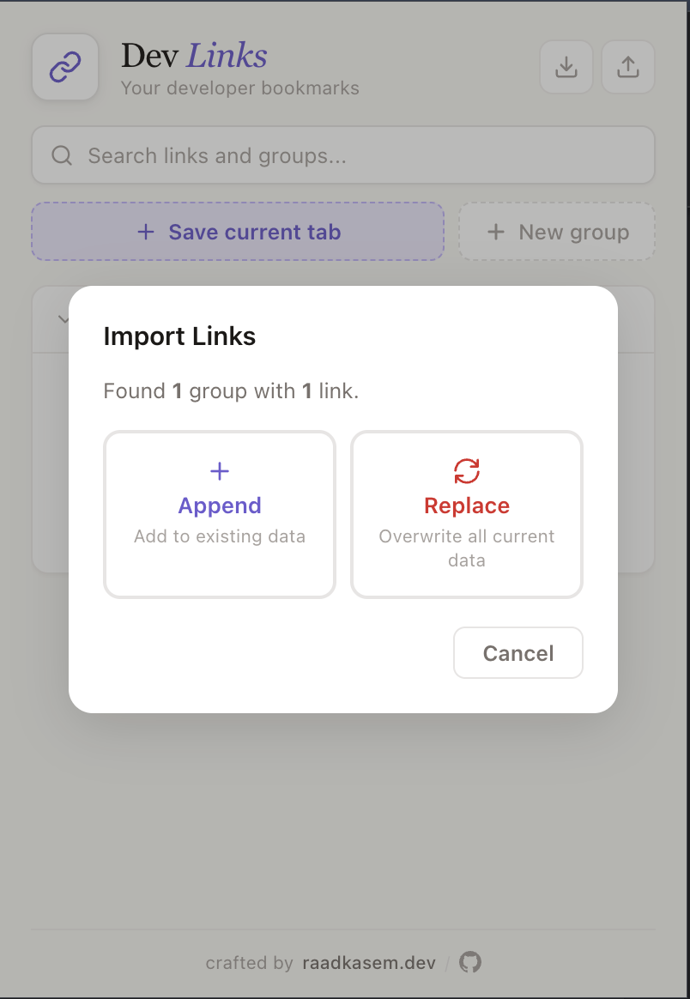

# Dev Links Bookmark


Chrome extension to organize your developer links into groups — save, search, lock, and open them instantly.

## Screenshots

<p align="center">
  
  
  
  
</p>

## Features

- Create groups with color labels (e.g., "Projects", "DevOps", "Personal")
- Add, edit, and delete links with URL validation
- Credentials per link: username/email, password (masked with reveal toggle), repo/branch
- Branch field with autocomplete suggestions (main, develop, staging, production, etc.)
- Inline credentials card — click any link to expand, with copy buttons per field
- Autofill button — injects credentials into the current page's login form
- Save current tab to any group with one click
- Search across all groups, links, and URLs
- Open all links in a group at once
- Drag and drop to reorder groups and links between groups
- Lock groups to prevent accidental edits or deletions
- Delete protection — confirm dialog for links, type "Delete" for groups with links
- Export all data or a single group as organized JSON
- Export then Delete option for safe group removal
- Import with Append or Replace mode (icon buttons)
- Favicons auto-loaded for each link
- Collapsible groups (accordion style)
- Elegant light theme UI

## Export Format

```json
{
  "exportedAt": "2026-03-30T12:00:00.000Z",
  "version": "1.0",
  "totalGroups": 2,
  "totalLinks": 5,
  "groups": [
    {
      "name": "Projects",
      "color": "#6D5BD0",
      "links": [
        {
          "name": "Dashboard",
          "url": "https://dashboard.project.com",
          "username": "admin@project.com",
          "password": "****",
          "branch": "main"
        }
      ]
    }
  ]
}
```

## Install

1. Clone or download this repo
2. Open `chrome://extensions`
3. Enable **Developer mode**
4. Click **Load unpacked** and select the project folder

## License

[MIT](LICENSE)

## Author

**Raad Kasem** — [raadkasem.dev](https://raadkasem.dev) · [GitHub](https://github.com/raadkasem)
